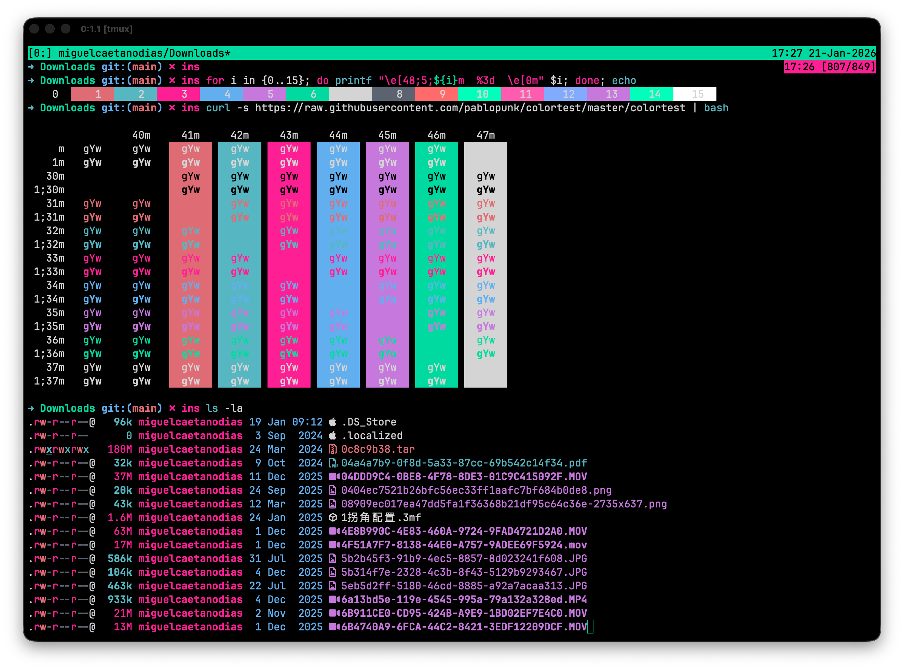

# mdias-oled Theme Suite


A complete OLED-friendly theme suite for your terminal environment. Pure black backgrounds, marine green accents, and hot pink highlights. Inspired by **vaporwave** aesthetics.




## What's Included

| App | Description |
|-----|-------------|
| **OpenCode** | Full theme with syntax highlighting |
| **Ghostty** | Terminal color scheme |
| **tmux** | Status bar styling |
| **eza** | Colored file listings by extension |
| **zsh** | Prompt colors and eza aliases |

## Color Palette

| Role | Color | Hex |
|------|-------|-----|
| Background |  | `#000000` |
| Text |  | `#d4d4d4` |
| Primary |  | `#56b6c2` |
| Accent |  | `#00d9a0` |
| Highlight |  | `#ff2094` |
| Error |  | `#e06c75` |
| Blue |  | `#61afef` |
| Magenta |  | `#c678dd` |

## Quick Install

```bash
git clone https://github.com/mcdays94/mdias-oled-theme-suite.git
cd mdias-oled-theme-suite
./install.sh
```

## Manual Installation

### OpenCode

```bash
cp opencode/mdias_oled.json ~/.config/opencode/themes/
```

Add to `~/.config/opencode/opencode.jsonc`:
```json
{
  "theme": "mdias_oled"
}
```

### Ghostty

```bash
cp ghostty/mdias-oled ~/.config/ghostty/themes/
```

Add to `~/.config/ghostty/config`:
```
theme = mdias-oled
```

### tmux

Add to `~/.tmux.conf`:
```bash
source-file ~/path/to/mdias-oled-theme-suite/tmux/mdias-oled.conf
```

Or copy the contents directly into your `.tmux.conf`.

### eza (colored ls)

The installer will offer to install eza automatically. If you prefer manual installation:

```bash
# macOS
brew install eza

# Ubuntu/Debian
sudo apt install eza

# Arch
sudo pacman -S eza
```

Copy the theme:
```bash
mkdir -p ~/.config/eza
cp eza/theme.yml ~/.config/eza/theme.yml
```

Add aliases to `~/.zshrc`:
```bash
alias ls="eza --color=always --icons=auto"
alias ll="eza -l --color=always --icons=auto"
alias la="eza -la --color=always --icons=auto"
alias lt="eza -T --color=always --icons=auto"
```

### zsh (optional)

For the full zsh snippet with prompt colors, add to `~/.zshrc`:
```bash
source ~/path/to/mdias-oled-theme-suite/zsh/mdias-oled.zsh
```

## Features

- **Pure black background** (`#000000`) - Perfect for OLED displays, saves battery and prevents burn-in
- **OLED-friendly text** - Soft gray instead of harsh white to reduce eye strain
- **Vibrant marine green** - Eye-catching accent color that pops on black
- **Hot pink highlights** - Bold accent for warnings and emphasis
- **Consistent colors** - Same palette across all tools

## Inspiration

This theme draws inspiration from **vaporwave** aesthetics - combining neon cyans and hot pinks against pure black, evoking late-night coding sessions and retro-futuristic vibes.

## License

MIT
